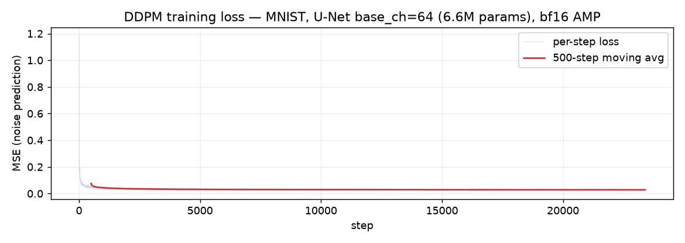
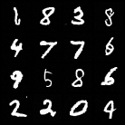
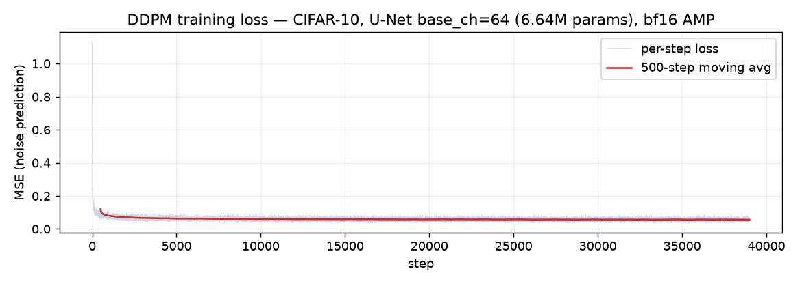
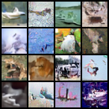
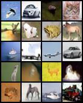
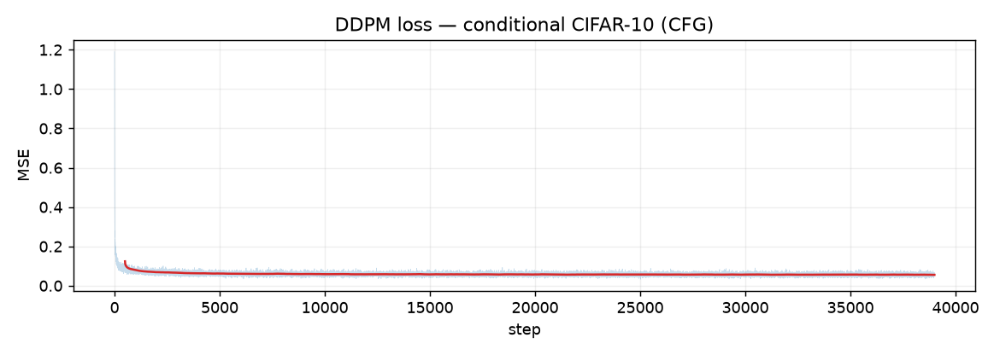

# 🎨 PicoDiffusion — image generation from scratch

**A diffusion model (DDPM + DDIM) implemented from first principles in PyTorch — no `diffusers` and no pretrained generative weights.**

A U-Net learns to denoise pure noise back into real images; DDIM turns that into a
fast deterministic sampler. The core U-Net and diffusion algorithms are
implemented directly with PyTorch. Evaluation uses torchvision's pretrained
InceptionV3 only to extract features for the internal FID-style diagnostic.

> Part of a from-scratch ML systems series: [pico-kernels](https://github.com/Labeeb2339/pico-kernels) (Triton kernels) · [PicoLM](https://github.com/Labeeb2339/picolm) (a GPT from scratch) · [pico-engine](https://github.com/Labeeb2339/pico-engine) (a GGUF inference engine).

## What's inside

| Component | What it is |
|-----------|------------|
| **U-Net** (`model.py`) | Residual blocks with time conditioning, group norm + SiLU, self-attention at low resolutions, encoder-decoder with skip connections |
| **DDPM** (`diffusion.py`) | Forward (add-noise) process + cosine noise schedule + the reverse sampler (Ho et al., 2020) |
| **DDIM** (`diffusion.py`) | Deterministic `eta=0` sampler that trades steps for speed (Song et al., 2020) |
| **DPM-Solver++ 2M** (`diffusion.py`) | 2nd-order multistep ODE solver (Lu et al., 2022); without clipping, its 1st-order equation is algebraically equivalent to DDIM, while the stability clamp used here changes the finite-step update |
| **Latent diffusion** (`vae.py`, `train_ldm.py`) | VAE compresses 3×32×32 → 4×8×8 latent, then a U-Net denoises *latents* |
| **Training** (`train.py`) | Noise-prediction MSE loss, AdamW, EMA of weights, periodic sample + checkpoint saves |
| **Sampling** (`sample.py`) | Generate a grid of images from a checkpoint |

## How it works

1. **Forward process** — `x_t = √(ᾱ_t) x_0 + √(1-ᾱ_t) ε` turns any image into noise
   over `T` steps (cosine schedule).
2. **Training** — the U-Net is given a noisy image `x_t` and the timestep `t`, and
   learns to predict the noise `ε`. Loss is simple MSE against the true noise.
3. **DDPM reverse** — start from pure noise and repeatedly denoise using the
   posterior `p(x_{t-1} | x_t)`.
4. **DDIM reverse** — a non-Markovian shortcut that predicts `x_0` directly and
   re-noises. In this project it produces useful samples with 49 model
   evaluations from 50 timestep points, instead of a full 1000-step DDPM loop.

## Results

> **Evidence status (2026-08-22):** clean, sequential `--no-cache` evaluations
> now bind the two surviving pixel-space checkpoints to commit `32f10ab`, the
> canonical 10,000-image CIFAR-10 test-set identity, the same seeded 2,048-image
> subset, every generated/evaluation array, and the recorded CUDA environment.
> The receipts, stdout logs, and checksums are published in
> [`evaluation_runs/20260822-162514Z`](evaluation_runs/20260822-162514Z).
> Sampler and latent-model numbers remain historical pre-hardening evidence and
> are inventoried separately in
> [`receipts/historical-fid-pre-hardening.json`](receipts/historical-fid-pre-hardening.json).

The surviving pixel and latent checkpoints also have **legacy training-loop
provenance**. Their original loop applied EMA weights directly to the live model
at each sampling interval before training continued. The current loop uses EMA
only temporarily and then restores the training weights. A current-harness rerun
therefore evaluates the exact recorded checkpoint bytes; it does not establish
that those checkpoints were produced by the current training code.

### MNIST (recorded training artifact)

U-Net with `base_ch=64` (6.6M params), cosine schedule, 1000 timesteps,
50 epochs (23,400 steps) on an RTX 5070 Laptop GPU (~77s/epoch). The recorded
artifact was trained in FP32; the current code correctly enables bf16 AMP on CUDA.

**Training loss: 1.19 → 0.028** (final 500-step moving average):



**Samples** — 16 digits from pure noise (DDIM, 50 steps), zero pretrained weights:



### CIFAR-10 (recorded training artifact; current fixed-checkpoint evaluation)

U-Net with `base_ch=64` (6.64M params), cosine schedule, 1000 timesteps,
100 epochs (39,000 steps) on an RTX 5070 Laptop GPU (~67s/epoch). The recorded
artifact was trained in FP32; the current code correctly enables bf16 AMP on CUDA.

**Training loss: 1.135 → 0.056** (final 500-step moving average):



**Samples** — 16 images from pure noise (DDIM, 50 steps), zero pretrained weights:



**Current-harness internal FID-style score = 54.4094** (2,048 generated vs
the same canonical seeded subset of 2,048 real test images, DDIM 50, seed 0,
torchvision ImageNet InceptionV3 features). The real-vs-real sanity score was
exactly `0.0`. This evaluates the preserved checkpoint with SHA-256
`66b2558a…86ae`; it does not reproduce its legacy training run. The earlier
pre-hardening log reported 53.23 under a less strictly bound harness.

> **Metric boundary:** this is a small-sample, repository-specific diagnostic,
> not canonical 50,000-sample CIFAR-10 FID. It is suitable for controlled
> comparisons between runs in this repository, but must not be compared directly
> with FID values reported in papers or from `pytorch-fid`/TensorFlow FID.

### Class-conditioned generation + classifier-free guidance

`model.py` gains a class embedding (`num_classes`), `train.py` trains on CIFAR-10
labels with 10% label dropout, and `ddim_sample`/`sample.py` support
classifier-free guidance: `pred = uncond + w * (cond - uncond)` at each step.

**Samples** — 20 images, 2 per class, classifier-free guidance `w=3.0`:





**Current-harness internal FID-style score = 38.6036** (class-conditioned,
CFG `w=2.0`, DDIM 50, n=2,048, seed 0), versus **54.4094** for the preserved
unconditional checkpoint under the same commit, dataset identity, subset, and
environment. The conditional score is 29.05% lower. This remains an
observational comparison between separately trained checkpoints, with training
seeds and full training provenance not captured. It also combines two
changes—class conditioning and inference-time guidance—so it is not a
controlled A/B result. The current receipts verify the fixed checkpoint bytes
and evaluation protocol; they cannot remove those training confounders. The
earlier pre-hardening log reported 39.44.

```bash
# train a conditional model
python train.py --dataset cifar10 --epochs 100 --out-dir out_cifar_cond --cfg-scale 2.0 --cfg-dropout 0.1

# sample one class (e.g. class 3) with guidance
python sample.py --ckpt out_cifar_cond/ckpt.pt --num-classes 10 --class-idx 3 --cfg-scale 3.0
```

### Sampler study: DPM-Solver++ 2M (a useful failure case)

`diffusion.py` also implements **DPM-Solver++ 2M**, a 2nd-order multistep solver
of the probability-flow ODE. Without clipping, its 1st-order equation is
algebraically equivalent to DDIM (`eta=0`). In this implementation, the
essential `x0` stability clamp makes their finite-step updates differ. The
2nd-order term reuses the previous step's `x0` prediction.

The historical result on this model is that it does **not** beat DDIM:

| sampler        | internal score @ 20 steps | internal score @ 50 steps |
|----------------|----------------|----------------|
| DDIM (`eta=0`) | 67.64          | **53.23**      |
| DPM-Solver++ 2M| 73.58          | 64.02          |

These are single historical pre-hardening runs, not a replicated sampler
benchmark. Standalone stdout evidence survives for DPM-Solver++ at 20 steps; the
other sampler-table cells currently rely on the recorded README values.

The observed stability problem is concrete: at high `t`, `α ≈ 1e-5`, so the
unclipped estimate `x0 = (x − σ·ε)/α` can become extremely large. The working
hypothesis is that clipping this estimate disrupts the smooth `x0` trajectory
assumed by the multistep correction. That mechanism has not been isolated with a
clipping ablation or an external reference implementation, so it is not claimed
as a causal result. A synthetic regression test verifies that the 2nd-order path
reduces numerical error against a finer reference; the historical checkpoint
comparison only shows that it did not improve this repository's measured image
score.

### Latent diffusion (recorded end-to-end run; metric rerun pending)

`vae.py` compresses 3×32×32 → 4×8×8 (12× compression) with an L1 reconstruction
+ weak KL (`β=1e-4`) objective; `train_ldm.py` then trains a *smaller* U-Net
(4.68M params) to denoise those latents instead of pixels.

Two historical pre-hardening numbers from the same harness:

| model | internal FID-style score (n=2048) |
|-------|--------------|
| latent diffusion, **before** latent normalization | 143.43 |
| latent diffusion, **after** latent normalization | **105.36** |
| pixel-space DDIM (reference) | 53.23 |

**What the -38-point observation suggests:** the measured weak-KL VAE latents
have per-channel standard deviations of 1.4–2.4 and near-zero posterior σ, while
the diffusion schedule has an implicit unit-scale signal-to-noise assumption.
Standardizing the latents before diffusion and reversing that transform before
decoding addresses the measured scale mismatch. This serves the same goal as
latent scaling in latent-diffusion systems, while this repository uses measured
per-channel means and standard deviations. In one historical pair of separately
trained, unseeded runs, normalization coincided with an internal-score change
from 143.43 to 105.36 and a training-loss change from 0.45 to 0.34. The scale
measurements support the mechanism, but the single comparison does not isolate a
causal effect.

**Current interpretation:** latent diffusion is implemented and locally
smoke-tested end-to-end, but the historical latent checkpoint underperformed the
historical pixel-space checkpoint at 32×32. Likely contributors include VAE
reconstruction blur and a 12× bottleneck on an already low-resolution image;
these contributors have not been separated by ablation. Latent diffusion is
generally aimed at higher resolutions, where spatial compression saves more
compute. The architecture and regression tests are current; the image-quality
comparison remains historical pending rerun.

## Quickstart

```powershell
# Run from the repository root with the Python version you intend to record.
python -m venv .venv
$python = ".\.venv\Scripts\python.exe"
& $python -m pip install --upgrade pip
& $python -m pip install torch torchvision --index-url https://download.pytorch.org/whl/cu128
& $python -m pip install -r requirements.txt

# Train (CIFAR-10 or MNIST)
& $python train.py --dataset cifar10 --epochs 100
& $python train.py --dataset mnist --base-ch 32 --epochs 2   # fast smoke run

# Generate samples (DDIM, 50 steps)
& $python sample.py --ckpt out/ckpt.pt --channels 3 --n 16
```

CIFAR-10 and MNIST download automatically in a fresh clone. The original
machine's unpacked CIFAR-10 ImageFolder mirror is reused when present.
`scripts/run_fid_receipts.ps1` uses the repository `.venv` by default; if a
different environment is selected, pass its interpreter through `-Python`.

### Local meeting demo (no retraining)

The trained checkpoints are intentionally gitignored because they are large and
are not currently distributed by this repository. The commands below and the
guarded FID runner provide **owner-machine reproducibility** for the preserved
local checkpoint files. A clean clone can install, test, and train from source,
but cannot reproduce the recorded checkpoint scores unless hash-matched model
artifacts are published separately.

On the original machine, these commands were smoke-tested on CUDA:

```powershell
# Unconditional CIFAR-10: writes a 2x2 grid in a few seconds
& $python sample.py --ckpt out_cifar/ckpt.pt --n 4 --steps 10 --out out_cifar/meeting_demo.png

# Class-conditioned CIFAR-10: cycles through all ten classes
& $python sample.py --ckpt out_cifar_cond/ckpt.pt --n 10 --steps 20 --cfg-scale 2.0 --out out_cifar_cond/meeting_demo.png

# Normalized latent diffusion: demonstrates the VAE + latent denoiser path
& $python sample_ldm.py --vae-ckpt out_vae/vae.pt --ldm-ckpt out_ldm_norm/ckpt.pt --latent-stats out_ldm_norm/latent_stats.pt --n 4 --steps 10 --out out_ldm_norm/meeting_demo.png
```

Use the curated `assets/` images for the clearest presentation; 10-step smoke
outputs prioritize speed over visual quality. Sampling defaults to seed 0 for a
controlled local rerun; bitwise identity is not guaranteed across hardware or
library versions.

## Files

```
model.py       # U-Net (residual blocks + attention + time embedding)
diffusion.py   # DDPM + DDIM + DPM-Solver++ (schedules, forward, reverse, loss)
train.py       # training loop with EMA + sampling
sample.py      # sample a grid from a checkpoint
vae.py         # VAE (encoder/decoder) for latent diffusion
train_vae.py   # train the VAE
train_ldm.py   # train diffusion in the VAE latent space
sample_ldm.py  # sample latent diffusion + decode
fid.py         # internal FID-style evaluation + machine-readable receipts
fid_ldm.py     # latent-diffusion evaluation path
EVALUATION_REPRODUCIBILITY.md  # exact rerun and acceptance protocol
receipts/      # hash-bound historical evidence inventory
scripts/run_fid_receipts.ps1  # guarded sequential n=2,048 rerun
```
